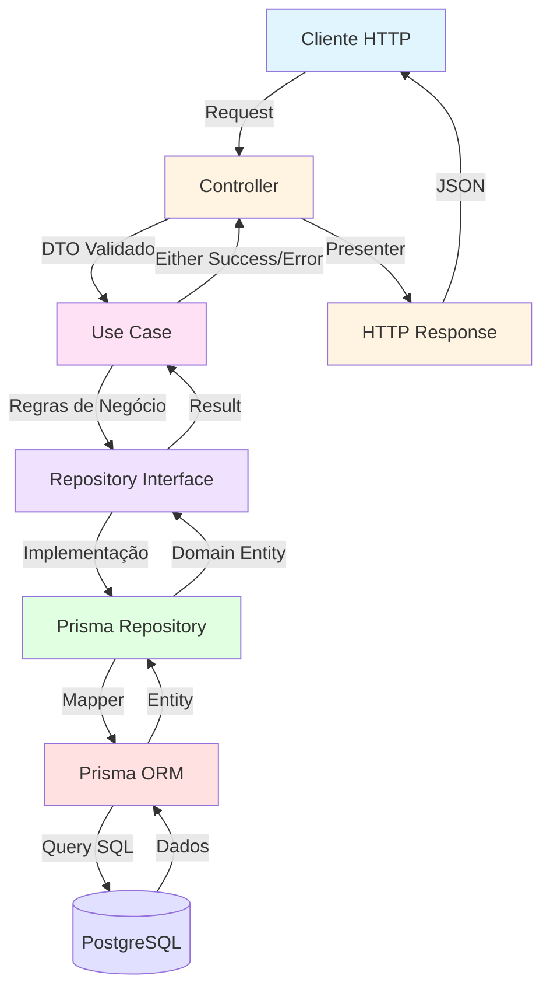

# Clinic Management API

Uma API REST robusta e escalável para gestão de clínicas, construída com **NestJS** e **TypeScript**, seguindo os princípios de **Domain-Driven Design (DDD)**, **Clean Architecture** e **SOLID**.

O projeto implementa um sistema completo de gerenciamento clínico com módulos de usuários, clientes, profissionais de saúde, procedimentos, agendamentos e anamnese, garantindo separação de responsabilidades, testabilidade e manutenibilidade do código.

---

## 📑 Sumário

- [Arquitetura](#-arquitetura)
- [Principais Módulos](#-principais-módulos)
- [Recursos e Diferenciais](#-recursos-e-diferenciais)
- [Tecnologias](#-tecnologias)
- [Instalação e Execução](#-instalação-e-execução)
- [Testes](#-testes)
- [Documentação API](#-documentação-api)
- [Fluxo da Aplicação](#-fluxo-da-aplicação)
- [Organização e Padrões](#-organização-e-padrões)
- [Evoluções Futuras](#-evoluções-futuras)
- [Licença](#-licença)

---

## 🏗️ Arquitetura

O projeto adota uma **arquitetura em camadas** baseada em **DDD** e **Clean Architecture**, garantindo alta coesão e baixo acoplamento:

```
src/
├── domain/                    # Camada de Domínio (Regras de Negócio)
│   ├── enterprise/
│   │   └── entities/         # Entidades de negócio puras
│   └── application/
│       ├── use-cases/        # Casos de uso (orquestração)
│       ├── repositories/     # Contratos de repositórios
│       └── cryptography/     # Contratos de criptografia
│
├── infra/                     # Camada de Infraestrutura
│   ├── http/
│   │   ├── controllers/      # Controladores REST
│   │   ├── presenters/       # Transformação de dados para HTTP
│   │   └── pipes/            # Validação (Zod)
│   ├── database/
│   │   └── prisma/           # Implementação Prisma
│   │       ├── repositories/ # Repositórios concretos
│   │       └── mappers/      # Mapeamento Domínio ↔ Persistência
│   ├── auth/                 # Autenticação JWT
│   └── cryptography/         # Implementações de hash/crypto
│
└── test/                      # Camada de Testes
    ├── factories/            # Factories para testes
    ├── in-memory-repositories/ # Repositórios em memória
    └── cryptography/         # Mocks de criptografia
```

### Princípios Aplicados

- **DDD**
- **Clean Architecture**: Inversão de dependência, independência de frameworks
- **SOLID**: Cada classe tem uma responsabilidade única e bem definida
- **Separation of Concerns**: Camadas isoladas com contratos bem definidos

---

## 📦 Principais Módulos

### 👥 **Users**
Gerenciamento de usuários do sistema com autenticação JWT RS256.

### 🏥 **Clients**
Cadastro e gerenciamento de clientes/pacientes da clínica.

### 👨‍⚕️ **Professionals**
Gestão de profissionais de saúde (médicos, biomédicos, odontologistas) com validação de licenças.

### 💉 **Procedures**
Registro e consulta de procedimentos realizados, vinculados a clientes e profissionais.

### 📅 **Appointments**
Sistema de agendamentos com busca e filtros avançados.

### 📋 **Anamnesis**
Fichas detalhadas de anamnese com histórico completo do paciente.

---

## ✨ Recursos e Diferenciais

### 🔐 Autenticação e Segurança
- **JWT RS256** com chaves assimétricas para máxima segurança
- Sistema de **Access Token** e **Refresh Token**
- Guards customizados e decoradores para proteção de rotas
- Estratégia de autenticação baseada em **Passport JWT**

### 🛡️ Validação Robusta
- **Zod** para validação de schemas em runtime
- Pipes customizados para validação automática de DTOs
- Mensagens de erro descritivas e padronizadas

### 📚 Documentação Automática
- **Swagger/OpenAPI** completamente configurado
- Exemplos de request/response em todos os endpoints
- Documentação de erros e status codes
- Schemas detalhados para cada entidade

### 🧪 Testes Abrangentes
- **Testes unitários** para todos os casos de uso
- **Testes E2E** para fluxos completos da API
- **Vitest** como framework de testes (mais rápido que Jest)
- Repositórios in-memory para testes isolados
- Coverage reports detalhados

### 🎯 Padrões de Código
- **Presenters**: Transformação consistente de entidades para HTTP responses
- **Mappers**: Conversão bidirecional entre domínio e persistência
- **Either Pattern**: Tratamento de erros funcional sem exceptions
- **Factory Pattern**: Criação consistente de entidades em testes

---

## 🛠️ Tecnologias

- **[NestJS](https://nestjs.com/)** - Framework Node.js progressivo
- **[TypeScript](https://www.typescriptlang.org/)** - Superset tipado do JavaScript
- **[Prisma](https://www.prisma.io/)** - ORM moderno e type-safe
- **[PostgreSQL](https://www.postgresql.org/)** - Banco de dados relacional
- **[Zod](https://zod.dev/)** - Validação de schemas TypeScript-first
- **[Passport JWT](https://www.passportjs.org/)** - Estratégia de autenticação
- **[Swagger](https://swagger.io/)** - Documentação OpenAPI
- **[Vitest](https://vitest.dev/)** - Framework de testes unitários e E2E
- **[Docker](https://www.docker.com/)** - Containerização

---

## 🚀 Instalação e Execução

### Pré-requisitos

- Node.js 18+ e pnpm
- Docker e Docker Compose
- PostgreSQL (ou via Docker)

### Passo a passo

1. **Clone o repositório**
```bash
git clone <repository-url>
cd clinic
```

2. **Instale as dependências**
```bash
pnpm install
```

3. **Configure as variáveis de ambiente**
```bash
cp .env.example .env
# Edite o arquivo .env com suas configurações
```

4. **Suba o banco de dados com Docker**
```bash
docker-compose up -d
```

5. **Execute as migrations**
```bash
npx prisma migrate dev
```

6. **Gere o Prisma Client**
```bash
npx prisma generate
```

7. **Inicie o servidor de desenvolvimento**
```bash
pnpm run start:dev
```

A API estará disponível em `http://localhost:3333`

### Scripts Disponíveis

```bash
pnpm run start:dev     # Modo desenvolvimento com hot-reload
pnpm run start:prod    # Modo produção
pnpm run build         # Build da aplicação
pnpm run test          # Testes unitários
pnpm run test:e2e      # Testes end-to-end
pnpm run test:cov      # Testes com coverage
```

---

## 🧪 Testes

O projeto possui **cobertura completa de testes** unitários e E2E, garantindo a qualidade e confiabilidade do código.

### Executar Testes Unitários
```bash
pnpm run test
```

### Executar Testes E2E
```bash
pnpm run test:e2e
```

### Gerar Relatório de Coverage
```bash
pnpm run test:cov
```

### 📊 Cobertura de Testes

> **Screenshot do coverage report**
> 
> _[Inserir imagem do relatório de cobertura aqui]_

O projeto mantém alta cobertura de testes em:
- ✅ Casos de uso (use cases)
- ✅ Entidades de domínio
- ✅ Repositórios
- ✅ Controllers
- ✅ Fluxos E2E completos

---

## 📖 Documentação API

A documentação completa da API está disponível via **Swagger UI**.

### Acessar a Documentação

Após iniciar o servidor, acesse:

```
http://localhost:3333/docs
```

### 📸 Preview da Documentação

<p align="center">
  
</p>

<p align="center">
  
</p>

<p align="center">
  
</p>


A documentação inclui:
- 📋 Lista completa de endpoints
- 📝 Schemas de request e response
- 🔐 Autenticação JWT configurada
- 🧪 Interface para testar endpoints diretamente
- 📊 Exemplos de uso para cada operação

---

## 🔄 Fluxo da Aplicação

### Arquitetura de Requisições



### Fluxo Detalhado

1. **Requisição HTTP** chega ao Controller
2. **Validação Zod** valida o payload via Pipe customizado
3. **Controller** invoca o Use Case apropriado
4. **Use Case** executa regras de negócio e orquestra repositórios
5. **Repository** (interface) define contrato de persistência
6. **Prisma Repository** implementa o contrato
7. **Mapper** converte entre Entity de domínio ↔ Prisma model
8. **Prisma ORM** executa queries no PostgreSQL
9. **Presenter** formata a resposta para o padrão HTTP
10. **Response** retorna JSON ao cliente

---

## 🧩 Organização e Padrões

### Injeção de Dependência

Todos os módulos utilizam o sistema de **DI do NestJS**, garantindo:
- Baixo acoplamento entre camadas
- Facilidade para testes (injeção de mocks)
- Inversão de dependência (depende de abstrações)

### Separação de Camadas

```typescript
// ❌ ERRADO - Controller conhecendo Prisma
@Controller('/users')
export class UsersController {
  constructor(private prisma: PrismaService) {}
}

// ✅ CORRETO - Controller conhecendo apenas Use Case
@Controller('/users')
export class UsersController {
  constructor(private createUser: CreateUserUseCase) {}
}
```

### Either Pattern

Tratamento de erros funcional sem exceptions:

```typescript
type CreateUserResponse = Either<
  EmailAlreadyExistsError,
  { user: User }
>;

// Uso
const result = await this.createUser.execute(data);

if (isLeft(result)) {
  const error = unwrapEither(result);
  throw new ConflictException(error.message);
}

const { user } = unwrapEither(result);
return { user: UserPresenter.toHTTP(user) };
```

### Presenters vs Mappers

- **Mappers**: Convertem entre Domínio ↔ Persistência (Prisma)
- **Presenters**: Convertem Domínio → HTTP Response

```typescript
// Mapper: Domain → Prisma
class PrismaUserMapper {
  static toPrisma(user: User): PrismaUser {
    return {
      id: user.id.toString(),
      name: user.name,
      email: user.email,
      // ...
    };
  }
}

// Presenter: Domain → HTTP
class UserPresenter {
  static toHTTP(user: User) {
    return {
      id: user.id.toString(),
      name: user.name,
      email: user.email,
      createdAt: user.createdAt,
    };
  }
}
```

---

## 🚧 Evoluções Futuras

### Infraestrutura
- [ ] **CI/CD Pipeline** com GitHub Actions
- [ ] **Monitoramento**
- [ ] **Cache Redis** para otimização de queries

### Features
- [ ] **RBAC** (Role-Based Access Control)
- [ ] **Notificações** via email e SMS
- [ ] **Upload de arquivos** (prontuários, exames)
- [ ] **Relatórios** em PDF

## 📄 Licença

Este projeto está sob a licença MIT. Consulte o arquivo [LICENSE](LICENSE) para mais detalhes.

---

<div align="center">

**[⬆ Voltar ao topo](#clinic-management-api)**

</div>
